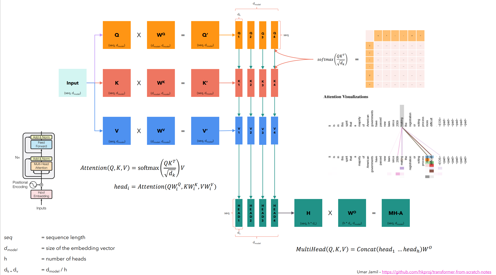
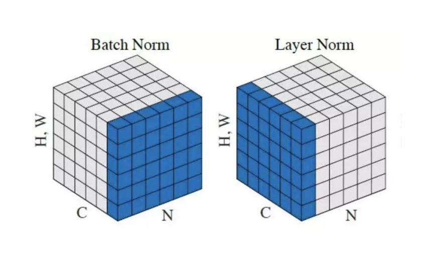
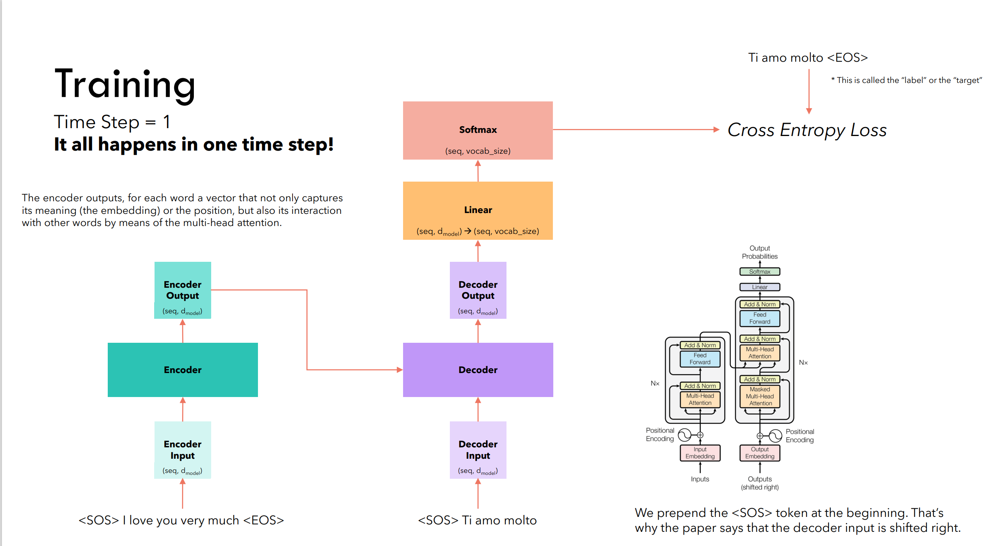

useful  reference: [PPT](./Diagrams_V2.pdf)

#  Problems with RNN(among others)

RNN: Recurrent Neural Network

1. Slow computation for long sequences
2. Vanishing or exploding gradients
3. Difficulty in accessing information from long time ago

# Intro to Transformer

What do we have?

## Input Embedding: 

Tokens ----> Input IDs(Look up in the vocab table)  ------> Embedding vectors(each is ,let’s say,512 dimensions)

$d_{model}=512$(dimension of embedding vectors)

## Positional Encoding: 

We want each word to carry some information about its  position in sentence. We want the model to  treat words that appear close to each other as “close” and words that are distant as “distant”.It’s only computed once and reused for every sentence during training and inference.

>  How to calculate?

PE(pos,2i) = $\sin(\frac{pos}{10000^{\frac{2i}{d_{model}}}})$

PE(pos,2i+1) = $\cos(\frac{pos}{10000^{\frac{2i}{d_{model}}}})$

e.g. Sentence 1: 

| YOUR      | CAT       | IS        |
| --------- | --------- | --------- |
| PE(0,0)   | PE(1,0)   | PE(2,0)   |
| PE(0,1)   | PE(1,1)   | PE(2,1)   |
| ...       | ...       | ...       |
| PE(0,511) | PE(1,511) | PE(2,511) |

The same position in different sentences has the same position embedding.

## Encoder Input = Embedding + Positional Embedding(both are 512 dimensions)

### What is Self-Attention?

Self-Attention allows the model to relate words to each other.

In this simple case we consider the sequence length seq= 6 and $d_{model}=d_{k}=512$(single head)

The matrices $Q,K$ and $V$ are just the input sentence.

$Attention(Q,K,V)=softmax\left(\frac{QK^T}{\sqrt{d_{k}}}\right)V$

$softmax(\frac{(6,512)\times(512,6)}{\sqrt{512}})$ All elements in a single row sum to 1.

$(6,6)\times(6,512)$--->$(6,512)$ 

Each row in this Matrix captures not only the meaning(given by the embedding) or the position in the sentence (represented by the positional encodings) but also each word’s interaction with other words.

### Self-Attention in detail

1. Permutation Invariant (Change the order of two rows will not change the value of each row)
2. Expect values along the diagonal to be the highest.
3. If we don’t want some positions to interact,we can always set their values to $-\infty$ before applying the softmax.

### Multi-head

$Q,K,V$ are just 3 copies of Input matrix.

Different heads just concatenate together to form a bigger heads.

Why we need different heads? These heads will see different aspects of possibilities of communication between raw words.

## Layer Normalization

Difference compared to batch normalization:

Layer: All the values belonging to single batch< independently >

Batch: Same features for all items in batch< mixing together >

## What is Masked Multi-Head Attention?

Our goal is to make the model causal: it means the output at a certain position can only depend on the  words on the previous positions. The model must not be able to see future words.

Inference: Several timesteps,to predict the next word by the largest softmax probabilities.
